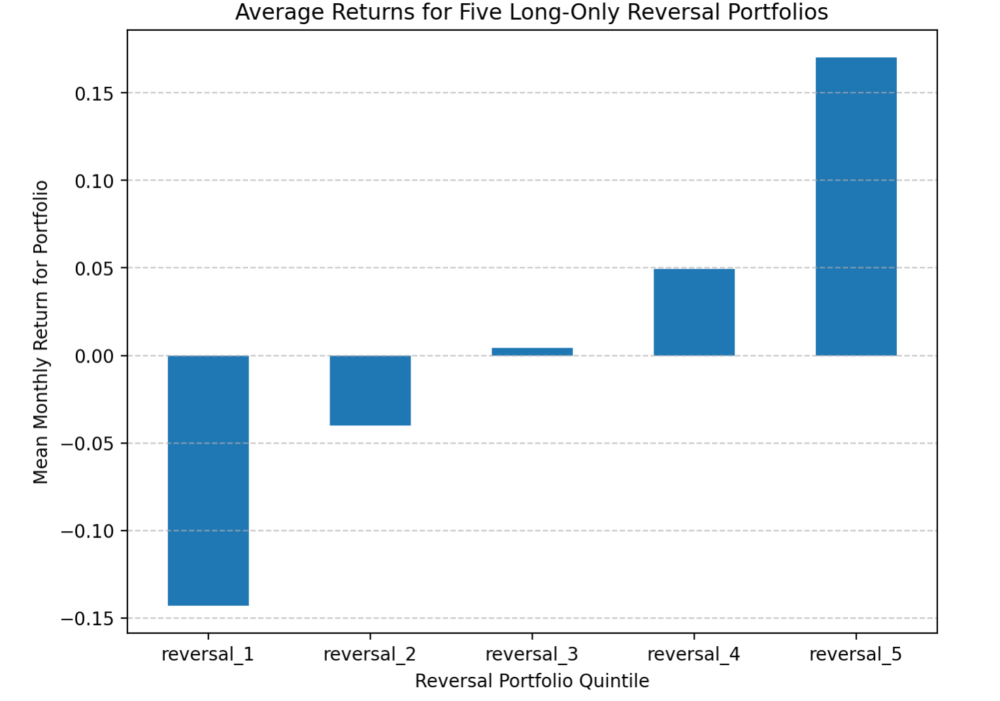

# Portfolio Returns Analysis

This project analyzes monthly returns for long-only reversal portfolios using Python and pandas. It includes data visualization and a comparison of average returns across multiple strategies.

## 🛠 Tools
- Python
- pandas, matplotlib
- Jupyter Notebook

## 📁 Files
- `HW4_Ramchandani_Simrin.ipynb`: The full notebook with analysis and charts
- `monthly_returns_HW4.csv`: Input dataset of monthly returns

## 📌 Key Highlights
- Worked with monthly return data to explore how different reversal portfolios perform over time  
- Calculated average returns for five portfolio groups and compared their results  
- Created a clear visualization to highlight performance differences across the quintiles  
- Gained a better understanding of reversal strategies and how to analyze them with data  

## 📷 Sample Visualization

**Average Returns for Reversal Portfolios**

This chart compares the average monthly returns of five long-only reversal portfolios.

